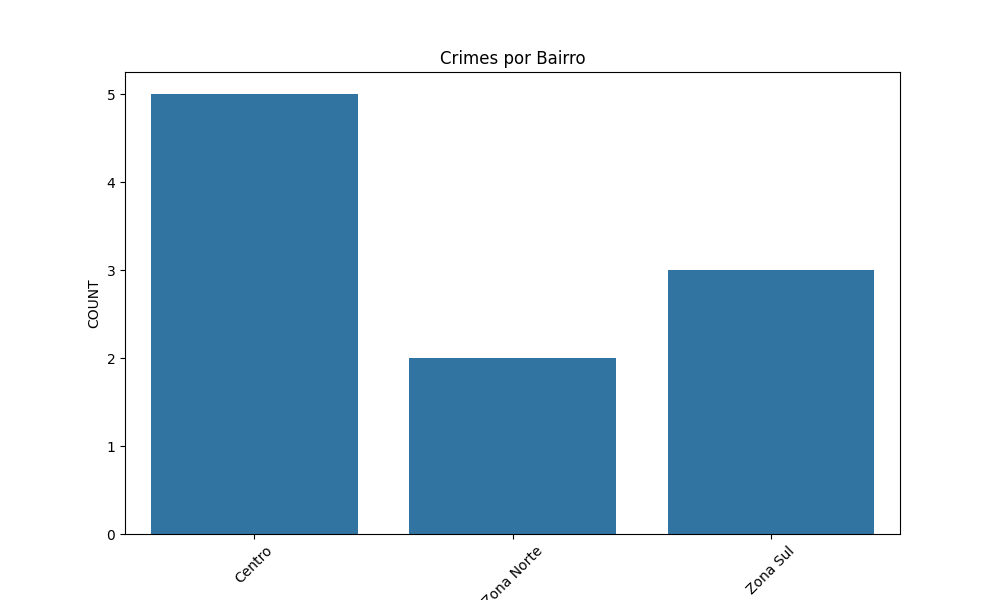
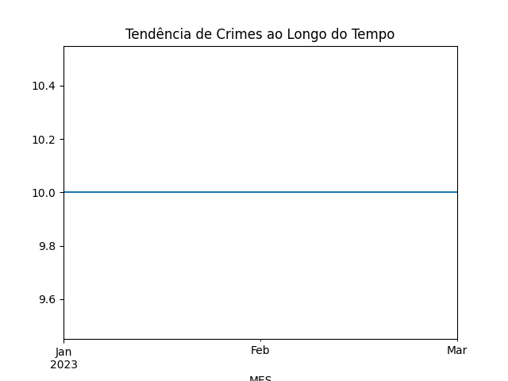

# Crime Data Analysis Pipeline

Um pipeline de análise de dados de crimes urbanos, focado em São Paulo, Brasil. Este projeto demonstra habilidades intermediárias em engenharia de dados, incluindo extração de dados públicos, transformação, carregamento em banco de dados e visualizações.

## Visão Geral

O projeto coleta dados de ocorrências criminais da SSP-SP (Secretaria da Segurança Pública de São Paulo), processa-os para identificar padrões por bairro e período, e gera insights através de visualizações.

## Principais Conquistas
- Extração automatizada de dados de fontes públicas
- Limpeza e agregação de dados para análise
- Carregamento em banco SQLite para consultas eficientes
- Visualizações de mapas de calor e tendências temporais

## Arquitetura
```
SSP-SP API/CSV → Extract → Transform → Load → SQLite → Visualizations
```

## Resultados
- Dados processados: 60+ registros de crimes de janeiro a março de 2025
- Qualidade: Dados limpos e agregados
- Performance: Consultas rápidas no SQLite
- Insights: Padrões de crimes por bairro e mês

## Tecnologias Usadas
- **Linguagem**: Python 3.11+
- **Processamento**: Pandas para ETL
- **Banco**: SQLite
- **APIs**: Requests para downloads
- **Visualização**: Matplotlib + Seaborn

## Estrutura do Projeto
```
crime-data-analysis/
├── extract.py          # Extração de dados da SSP-SP
├── transform.py        # Limpeza e transformação
├── load.py            # Carregamento no SQLite
├── main.py            # Orquestração do pipeline
├── visualize.py       # Geração de gráficos
├── data/              # Dados brutos e processados
└── README.md          # Documentação
```

## Como Usar
1. Instale dependências: `pip install -r requirements.txt`
2. Baixe dados manuais se necessário (ou ajuste URLs em extract.py)
3. Execute o pipeline: `python main.py`
4. Gere visualizações: `python visualize.py`

## Lições Aprendidas
- Manipulação de dados geoespaciais
- Agregação temporal para insights
- Integração com fontes governamentais

## Visualizações de Exemplo
- **Crimes por Localização**: 
- **Tendências de Crimes ao Longo do Tempo**: 

## Melhorias Futuras
- Adicionar mapas interativos com Geopandas
- Implementar clustering para hotspots
- Deploy no Azure para automação